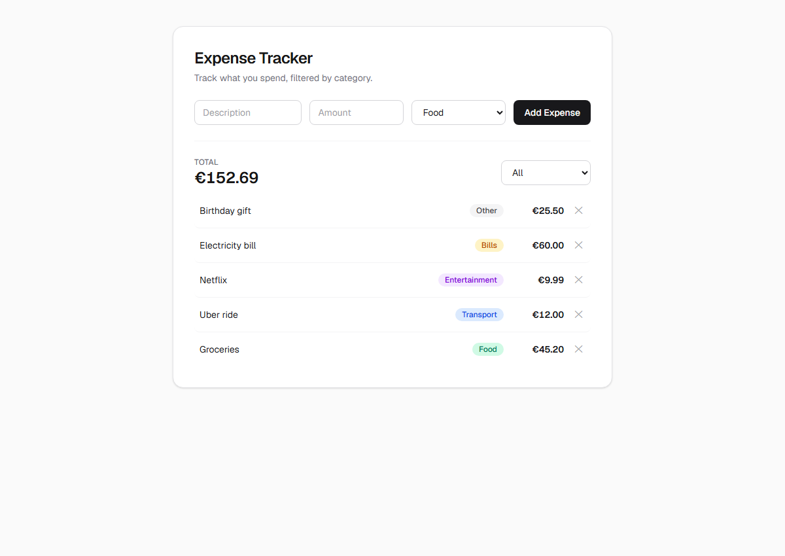
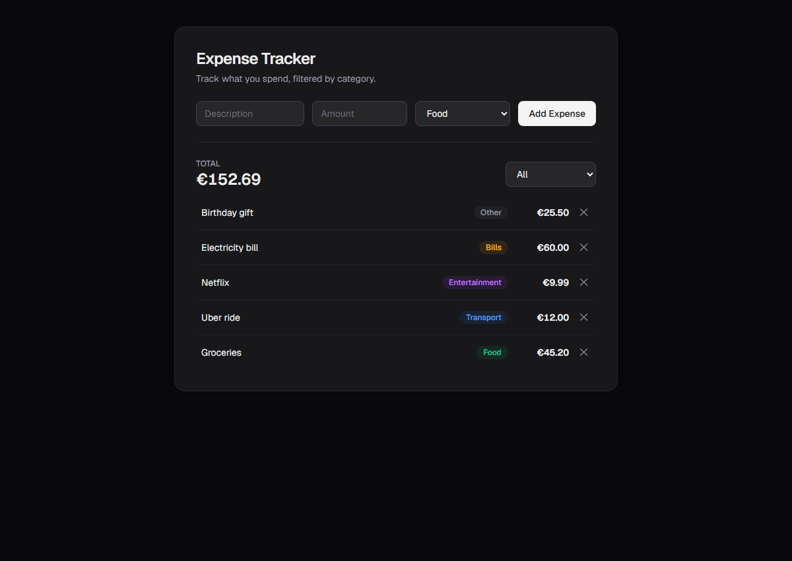
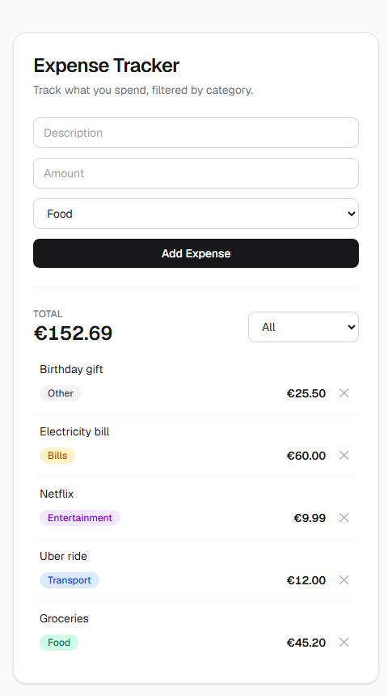

# Expense Tracker

A small, focused personal expense tracker built with Next.js, TypeScript, and Tailwind CSS. No backend, no database, no accounts — everything lives in the browser via `localStorage`.

**Live demo:** [expense-tracker-avylo1.vercel.app](https://expense-tracker-avylo1.vercel.app)

## Problem

Most people don't track day-to-day spending because the tools available are either too heavy (full budgeting apps with accounts, sync, and categorization ML) or don't exist at all (a spreadsheet nobody opens). This app is the smallest useful middle ground: add an expense in a few seconds, see the total instantly, no sign-up.

## Features

- Add an expense with a description, amount, and category
- View all expenses, most recent first
- Delete an expense
- Filter expenses by category
- See the total for the currently filtered view (not a fixed grand total)
- Data persists across page refreshes via `localStorage`
- Inline validation (empty description, non-positive amount) and empty-state messaging
- Responsive layout, works in light and dark mode

## Tech Stack

- [Next.js](https://nextjs.org) (App Router)
- [React](https://react.dev) + [TypeScript](https://www.typescriptlang.org)
- [Tailwind CSS](https://tailwindcss.com)
- [Vitest](https://vitest.dev) + [React Testing Library](https://testing-library.com/react) for tests
- Browser `localStorage` for persistence — no database, no backend, no external APIs

## Architecture

```
src/
├── app/
│   ├── layout.tsx        # root layout, fonts, metadata
│   ├── page.tsx          # owns all state; composes the components below
│   └── globals.css
├── components/
│   ├── ExpenseForm.tsx       # controlled form + validation
│   ├── ExpenseList.tsx       # list or empty state
│   ├── ExpenseListItem.tsx   # one row + delete button
│   ├── CategoryFilter.tsx    # category select
│   └── ExpenseTotal.tsx      # total display
├── lib/
│   └── storage.ts        # localStorage read/write, with safe fallbacks
└── types/
    └── expense.ts        # Expense interface, Category union, CATEGORIES list
```

State lives in a single place (`page.tsx`) and flows down as props; components communicate back up through callbacks (`onAdd`, `onDelete`, `onFilterChange`). There's no global store or Context — the component tree is shallow enough that prop passing is simpler and easier to follow than any state-management abstraction would be.

## Running Locally

```bash
git clone https://github.com/ioannissiros/expense-tracker.git
cd expense-tracker
npm install
npm run dev
```

Open [http://localhost:3000](http://localhost:3000).

Other scripts:

```bash
npm run build       # production build
npm run lint        # ESLint
npm test            # run the test suite once
npm run test:watch  # re-run tests on file changes
```

## Screenshots

| Light | Dark |
|---|---|
|  |  |

| Mobile |
|---|
|  |

## What I Learned

- Reading from `localStorage` on mount has to happen in a `useEffect`, not during render — the server has no `localStorage`, so reading it during render (e.g. a `useState` initializer) would make the server-rendered HTML disagree with the client on first paint.
- A native `<input type="number">` with `step="0.01"` silently blocks form submission for values like `12.999` via the browser's own constraint validation, before any of my JavaScript runs. Switching to `step="any"` and rounding the value myself on submit is what actually implements "handle extra decimals gracefully" — the bug never showed up in `tsc`, `lint`, or `build`, only in the running browser.
- Deriving a TypeScript union type from a runtime array (`(typeof CATEGORIES)[number]`) instead of declaring them separately keeps the type and the valid values from ever drifting apart.

## Future Improvements

Deliberately left out of this version to keep scope tight — not oversights:

- Editing an existing expense (currently delete-and-re-add covers the same need)
- Multiple currencies
- Exporting data (CSV/PDF)
- Recurring expenses / budgets / spending forecasts
- Custom, user-defined categories
